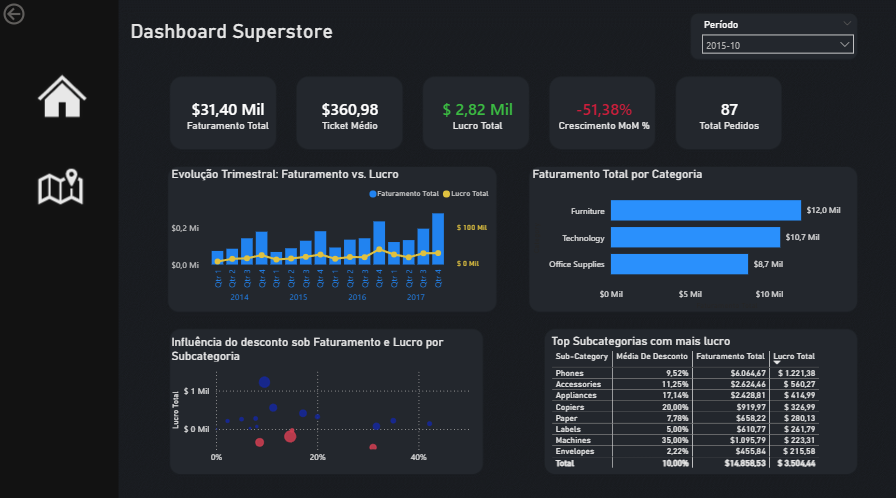
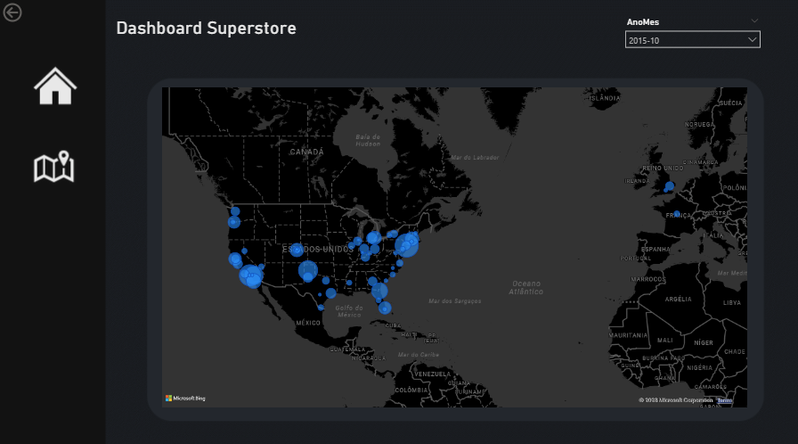

# 📊 Dashboard Superstore
O projeto tem como foco e função transformar e utilizar os dados brutos do dataset Superstore adquiridos no kaggle em uma ferramenta analítica para extrair insights e dar apoio a tomada de decisões.

Dataset: [Superstore](https://www.kaggle.com/datasets/vivek468/superstore-dataset-final/data)

-----

## 🎯 Objetivos:

- Explorar e visualizar a estrutura dos dados.
- Tratar valores e transformar colunas.
- Criar uma tabela Data para um Star Schema utilizando a coluna data do dataset.
- Estruturar e planejar as visualizações para um layout que responde aos problemas de negócio.
- Criação de Fórmulas DAX para responder cada problema de negócio.
- Criar hipóteses com insights para exemplificar a função do dashboard.

-----

## 💡 Principais Insights Obtidos no Projeto:

- As categorias Technology e Office Supplies foram as principais fonte de lucros da empresa, dando uma perspectiva de revisar o por que a Furniture deu pouco lucro quando comparamos com as duas.
- A categoria Furniture está dando prejuízo, quando filtramos suas subcategorias ao longo do tempo há um prejuízo de 20.000 dólares, a revisão de vendas e custo dessa categoria é essencial para o futuro da empresa.
- Ao analisar os descontos por produtos é visto uma alta significativa nos lucros quando o desconto fica entre 1-15%, a maioria que passa disso começa dar prejuízo.

-----

## ⚙️ Ferramentas e Técnicas utilizadas:
- Power BI: Desenvolvimento do dashboard e modelagem visual.
- Modelagem de Dados: Star Schema.
- DAX: Criação de medidas/métricas para os cálculos ex:(Ticket Médio, Lucro Total, Crescimento MoM %, etc...).
- Distribuição Geográfica para contribuir nos insights.

-----

## 📷 Visuais do Projeto: 

## Dashboard Pagina Principal

## Dashboard Análise Geográfica

-----

## 🚀 Conclusão:
Durante a construção do projeto sempre fiz questionamentos para chegar a visuais que agregassem a uma análise que realmente importasse e funcionasse para criar decisões futuras a fim do crescimento da empresa. Esse projeto reforçou minha ideia de que um analista de dados é muito importante para qualquer tipo de empresa/negócio.

Este projeto está sob a licença [MIT License](https://opensource.org/licenses/MIT)

**Autor:** Felipe Matos